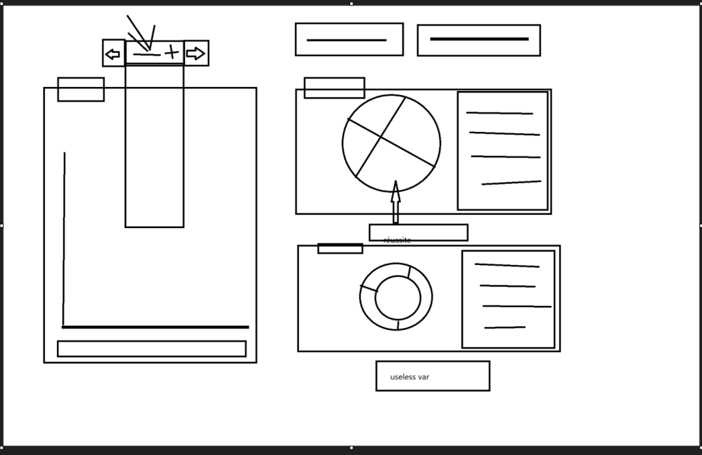
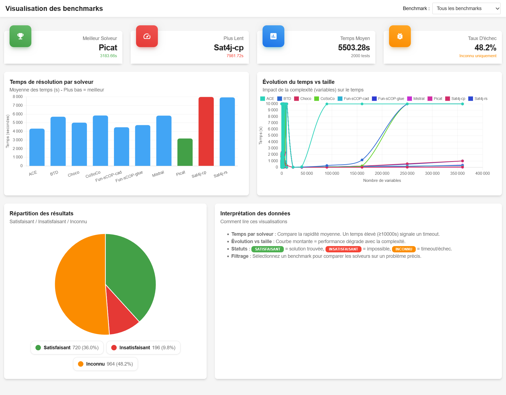

## Infos

⚠️ Il est nécessaire de lancer un server afin de visualiser les données ⚠️

-> exemple :  ```python -m http.server 8000```

## Composition d'équipe

- Mathéo Mollet
- Nathanaël Leang
- Nolwenn Louis

## Les problèmes rencontrés

1. Il fallait déjà réussir à bien comprendre le fichier de données. La plus grande difficulté a été de répartir les données de manière à ce que les graphes ne soient pas trop chargés et facilement compréhensibles pour les utilisateurs du site.
2. Nous voulions utiliser Material dashboard, mais nous ne comprenions pas exactement comment utiliser cette bibliothèque. 
3. Puisque notre groupe était composé de 3 personnes, il était plus difficile de bien se répartir le code et de s'organiser.

## Les solutions trouvées 

1. Avant de commencer à coder, nous avons testé plusieurs schémas dessinés à la main pour visualiser les graphes de données. Cela nous a permis de mieux visualiser les différentes solutions possibles.



2. Nous sommes donc repartis sur une meilleure base que nous connaissions, en nous inspirant du site de material dashboard pour le visuel mais en codant nous même.
3. Grâce à GitHub, nous avons pu plus facilement suivre ce que chaque membres faisait en créant des branches pour chaque personne. 

## Visualisation proposée



Pour la représentation des données, nous avons décidé de diviser les données par problème. 
D'abord, l'utilisateur sélectionne un problème dans un select en haut à droite.
Dans la première ligne, il peut voir le meilleur et le pire solveur pour ce problème, le temps moyen de résolution pour tous les solveurs et le taux d'échec.
Le premier graphe montre le temps de résolution par solveur, le deuxième, le temps de résolution par rapport à la taille, le troisième, le taux de réussite pour tous les solveurs.
En bas à droite, un cadre qui explique aux utilisateurs comment comprendre les différents graphiques.
Enfin, le site fonctionne également sur d'autres formats d'appareils.